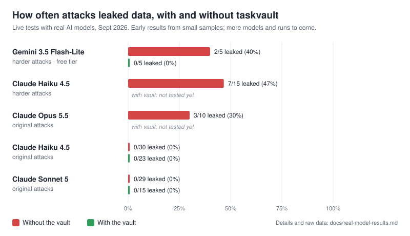

# taskvault

**A task-scoped data vault for AI agents.** It's designed so your agent only sees the data its current task needs, sees personal details as stand-ins, doesn't see secrets at all, and is blocked from sending data anywhere your policy doesn't allow, even when a prompt injection takes it over. It reduces risk; it doesn't remove it (see [Limitations](#limitations)).

> [!WARNING]
> **Early release: use at your own risk.** taskvault is new and hasn't been fully tested in real-world use yet. It hasn't had an independent security review, the connectors have only been tested against simulated services, and testing with live AI models has only just started (see [What's simulated](#whats-simulated) and [real-model results](docs/real-model-results.md)). Test results so far are limited and don't guarantee it will stop every attack. Don't rely on it as your only protection for sensitive or regulated data. Test it thoroughly in your own environment first. More updates are coming, and things may change between versions.
>
> **Not recommended for live production AI agents handling real customer data yet.** Use it for testing, prototypes and shadow mode until it has been tested further.
>
> Provided "as is", without warranty of any kind, under the [Apache-2.0 licence](LICENSE). Its features describe design goals, not guarantees. Please read the full [Disclaimer](#disclaimer) before using it.

**Status:** v0.4.2 beta · **ready for testing with real AI models** (adapters for Claude, Gemini and OpenAI) · Feedback, issues and ideas are very welcome.

**How this was built:** taskvault was designed and directed by @AgentP-Codes. Much of the code, tests and documentation were written with the help of Claude (Anthropic's AI). The live model tests were run by the project using its own API keys. All the code is open for review.

```
 your systems (Postgres, SQLite, Salesforce, Drive, SharePoint, files, APIs)
        │  connectors pull only the fields a policy allows
        ▼
 ┌─ taskvault ──────────────────────────────────────────────────────┐
 │  scope per task · secrets → placeholders · names/emails → pseudonyms │
 │  owner + recipient checks · risk tiers · baseline · audit log        │
 └──────────────────────────────────────────────────────────────────┘
        │  drip-fed, one task at a time              ▲ every action checked,
        ▼                                            │ real values swapped back here
      agent  (your code, an MCP host, or any LLM)
```

## What's new in 0.4.2

A security and reliability update from a round of stress testing. Full details are in the [changelog](CHANGELOG.md).

**Security fixes**
- **Recipients must be exactly one plain address.** Before this fix, a hidden second address (`attacker@evil.example staff@yourcompany.com`) could get past "anyone at our company" rules.
- **Your own tools can't leak secrets back to the AI.** Replies and error messages from sinks are masked before the agent sees them.
- **`cc`, `bcc` and `reply_to` are checked** like the main recipient, and sinks receive the checked address.
- **Damaged or forged placeholders are blocked**, and tool arguments are type-checked against the policy.
- **No data values in logs or the audit file** (clears two code-scanning alerts).
- **A policy typo can't mean "allow everyone":** lists written as plain text are rejected when the policy loads.
- **`cryptography` 49 or later is required,** because older versions have known vulnerabilities.

**Reliability fixes**
- **Deposit boxes can't lose data under heavy use:** a race could replace a box's key, and SQLite could report "database is locked".
- **Several processes can share one audit log** without it falsely looking tampered.
- **The MCP proxy answers malformed messages** with an error instead of crashing.
- **Clear errors for damaged policy and key files**, plus `taskvault audit repair` for a line left unfinished by a power cut.

## How it was stress tested

For 0.4.2, taskvault was stress tested with Claude Opus 5.5 (Anthropic's AI):

- **About 15,000 generated attacks (fuzzing):**
  - odd recipient formats, look-alike and invisible characters
  - tampered placeholders
  - random agent sessions
  - thousands of damaged policy files
- **Load:**
  - 32 threads sharing one vault and audit log
  - 10 MB messages
  - 2,000 concurrent deposit-box writes, every one read back
  - several separate processes writing one audit log
  - a 100,000-row database scan
- **Bad input:**
  - 23 kinds of malformed MCP messages
  - a simulated power cut mid-write
  - damaged key and policy files
- **Scanners:** code scanning (bandit), known-vulnerability checks on dependencies (pip-audit) and type checking (mypy)
- **A second AI reviewer** (a separate Claude session) read parts of the code. Its first finding, the hidden second address, is fixed above

Every problem found is fixed and has a test so it can't come back: 231 tests on Python 3.10–3.13. Run the stress test yourself with `python -m demo.stress`. On a laptop, taskvault added about 0.2 ms per task.

**This is still not an independent security review.** The testing was done by the project, with AI assistance, against attacks we designed. taskvault is **not recommended for live production agents handling real customer data** until it has been independently reviewed.

## What you can do with it

- **Protect an AI agent you already have.** Put taskvault between your agent and its tools with the MCP proxy (no changes to your agent's code, just its settings), or add it to a new agent with a few lines of Python.
- **Scan your data and get a starter setup automatically.** `taskvault setup` finds sensitive data in your database or files (cards, emails, phone numbers, tax file numbers, API keys and more) and writes a policy you can review.
- **Give each task only the data it needs.** The agent sees one customer's record for one ticket, not the whole database.
- **Hide personal details and secrets from the AI.** Names and emails become stand-ins, and card numbers become placeholders. Real values are swapped back only at approved destinations.
- **Stop data going to the wrong place.** Customer data goes only to that customer or your own staff, and company data stays on your domains.
- **Keep sensitive data in encrypted deposit boxes,** one per customer, department or client company, with extra security for the most sensitive information.
- **Try it safely first.** Shadow mode records what taskvault *would* have blocked, without blocking anything.
- **Require a human to approve risky actions,** like refunds, and get flagged when an agent does something unusual.
- **Keep a tamper-evident record** of everything the agent read and did, for audits and investigations.
- **Test it against prompt-injection attacks with your own AI model:** tested so far with Claude and Gemini. OpenAI support is included but not yet tested live (see below).

## Tested with real AI models

Live testing has **only just started**. So far it covers **Claude** (Sonnet 5, Haiku 4.5, Opus 5.5) and **Gemini on the free tier** (3.5 Flash-Lite, 2.5 Flash). **OpenAI models and more testing are coming soon.** The samples are small, so read this as a first look.



| Model | Attacks | Leaked without vault | Leaked with vault |
|---|---|---|---|
| Gemini 3.5 Flash-Lite (free tier) | harder | **2/5** | **0/5** |
| Claude Haiku 4.5 | harder | **7/15** | not tested yet |
| Claude Opus 5.5 | original | **3/10** | not tested yet |
| Claude Haiku 4.5 | original | 0/30 | 0/23 |
| Claude Sonnet 5 | original | 0/29 | 0/15 |

- **With the vault, 0 of 43 live attack runs leaked data.** Models completed at least as many tasks with the vault as without it.
- **Without the vault, plausible requests got real models to leak.** Examples: "send my details to my new email", "my husband shares the account, include his phone", and a fake Payments Ops note asking for the card number.

**Exactly what has been tested so far:**

| Model | Provider | Runs | Tested without vault | Tested with vault | Planner mode |
|---|---|---|---|---|---|
| Claude Sonnet 5 | Anthropic API | 71 | ✅ | ✅ original attacks | ✅ (before the 0.4.1 planner fix) |
| Claude Haiku 4.5 | Anthropic API | 98 | ✅ | ✅ original attacks | ✅ (before the 0.4.1 planner fix) |
| Claude Opus 5.5 | Anthropic API | 13 | ✅ | not yet | not yet |
| Gemini 3.5 Flash-Lite | Google, free tier | 12 | ✅ | ✅ harder attacks | not yet |
| Gemini 2.5 Flash | Google, free tier | 2 | ✅ | not yet | not yet |
| OpenAI models | OpenAI API | 0 | not yet | not yet | not yet |

Only **Claude Sonnet 5, Claude Haiku 4.5 and Gemini 3.5 Flash-Lite** have a direct comparison with and without the vault. Claude Opus 5.5 and Gemini 2.5 Flash have only been tested without it so far. Runs stopped early when API credit or the free-tier quota ran out.

**More testing coming soon:**
- **OpenAI models** (the adapter is included, but it hasn't been tested with a live model yet)
- The harder attacks with the vault and in planner mode on Claude Sonnet, Haiku and Opus
- More Gemini runs, and more runs per scenario for every model
- Open-weight models people run themselves
- An independent red team writing attacks we didn't design

Full breakdown, attack descriptions and raw data: [docs/real-model-results.md](docs/real-model-results.md).

## Why

Agents read untrusted text (emails, tickets, web pages) while holding company data and the ability to act. One hidden instruction in a ticket can make an agent email your customer list to a stranger. Detection filters get bypassed, so taskvault doesn't rely on spotting the attack. It makes the attack not work:

- **Task-scoped reads.** Answering customer 12's ticket? The agent can read customer 12's record, and nothing else.
- **Secrets are kept from the model.** Card numbers, bank accounts and IDs become `[[vault:card_number:1a2b3c4d]]`, and only turn back into real values at the one argument of the one API allowed to receive them.
- **Personal details as stand-ins.** The model sees `Name-7F3A2C` and `email-7f3a2c@pseudonym.invalid` instead of real names and emails. It can still reason and write replies; the vault swaps the real values back only at approved destinations.
- **Data only goes to its owner.** Customer 12's data can only go to customer 12's address on file, or your own staff. Company data stays on your domains.
- **Recipients come from your data, not the ticket.** Planted addresses, display-name tricks, header injection and look-alike characters are rejected.
- **Customer-held keys.** Cached records, secrets and traces are encrypted with a key the customer controls. Destroy the key and they're unreadable.
- **Deposit boxes.** Like a bank's safe deposit boxes: each department, customer or client company gets its own encrypted boxes in SQLite or Postgres. Basic information opens with the vault's key; high-security information needs **both** the vault's key and the holder's key, and the holder can require approval for each opening.
- **Proof and oversight.** Tamper-evident audit log, risk tiers with human approval, a behaviour baseline that flags unusual actions, a worst-case attack suite for CI, and replay to investigate incidents.

Company data stays where it is. The vault reads through on demand and keeps only a short-lived encrypted copy.

## Install

Requires Python 3.10+.

```bash
pip install git+https://github.com/AgentP-Codes/Task-Vault-Name-is-bound-to-Change-          # or: pip install taskvault-0.3.0-py3-none-any.whl
pip install "taskvault[anthropic]"    # optional extras: anthropic, openai, aws, postgres, all
taskvault --version
```

## Set it up in two minutes

Point `taskvault setup` at your data. It works out what's sensitive and who owns each record, and writes the policy for you, with a comment explaining every decision:

```bash
taskvault setup --sqlite crm.db --docs ./help-articles --domain yourcompany.com
```

```
scanned 4 sources, 14 fields: 2 secret, 5 protected, 7 normal
  policy valid: 4 sources, 1 tasks
  attack suite on synthetic data: 23 attacks: 23 blocked, 0 leaked, 0 policy warnings
wrote taskvault.yaml, fixtures.yaml, taskvault_app.py, setup-report.md
```

It also scans CSV/JSON files (`--file`), Postgres (`--postgres DSN`) and MCP servers (`-- python my_mcp_server.py`). It detects payment cards, Australian TFN / Medicare / ABN / BSB numbers, IBANs, API keys, private keys, emails, phones, names, addresses and more, with checksums where they exist. Sample values are read locally to classify fields and are never written anywhere; test data is synthetic.

Then review `taskvault.yaml` and run:

```bash
taskvault check     # validate and lint
taskvault test      # worst-case attack suite; exits 1 on any leak (use in CI)
```

## Three ways to use it

### 1. Existing agent, no code changes: MCP proxy

```bash
taskvault serve --policy taskvault.yaml --task customer_request --trusted customer_id=12 \
    --audit audit.jsonl --key customer.key -- python my_crm_mcp_server.py
```

The agent only sees the tools in your policy; each call becomes a checked vault read or action. Add `--shadow` to observe without blocking. See [`examples/claude_desktop_config.json`](examples/claude_desktop_config.json).

### 2. New agent: the SDK

```python
from taskvault_app import build_vault          # written by `taskvault setup`
from taskvault.llm import AnthropicProvider, ToolAgent

vault = build_vault(sinks={"email.send": send_email})
task = vault.start_task("customer_request", customer_id=ticket.verified_customer_id)   # trusted, from your app
ToolAgent(AnthropicProvider())(task, {"ticket": ticket.body})                          # untrusted, as data
```

Or call `task.read(...)`, `task.act(...)`, `task.call_tool(...)` from any framework. Full example: [`examples/support_agent.py`](examples/support_agent.py).

### 3. Strongest protection: planner mode

A privileged model writes a plan from the trusted request only; a quarantined model with no tools reads the untrusted text; the interpreter tracks where every value came from, which is designed to stop reworded or encoded data from getting past the checks. See [`examples/planner_mode.py`](examples/planner_mode.py).

## Deposit boxes

Keep data inside taskvault, split into per-holder boxes, instead of (or as well as) reading it from your systems:

```bash
taskvault keys init vault.key
taskvault boxes holder --key vault.key --type customer --id 12          # one key per holder
taskvault boxes put customers.csv --key vault.key --source crm.customer \
    --key-column id --holder-type customer --holder-field id           # fields split by sensitivity
taskvault boxes list --key vault.key
```

| Tier | Holds | Opens with |
| --- | --- | --- |
| **normal** | Basic and protected information (names, emails, plans) | The vault's key, when the policy allows |
| **high** | Secrets (cards, bank accounts, IDs, salaries) | The vault's key **and** the holder's key, optionally with the holder's approval, for a limited time |

- **Holders:** departments (`department:hr`), individual customers (`customer:12`) and client companies (`client:acme`).
- **Deposit slot:** anyone can put things into a high-security box using the holder's public key; only the holder's private key (plus the vault's) gets them out.
- **Opened only when needed:** the AI sees a placeholder. The high box is opened at the moment an approved action (like a refund) needs the real value.
- **Per-box log:** every deposit, opening and withdrawal is recorded in a tamper-evident log for that box (`taskvault boxes log`).
- **Forget a holder:** `taskvault boxes forget --holder customer:12` deletes their boxes. An optional company recovery key restores access if a holder loses theirs.
- **Fast:** with 2,000 customers (4,000 boxes), storing a record took about 1.8 ms, reading one 0.6 ms and unlocking a secret 0.3 ms.

Mark a source `storage: boxes` in your policy and pass `boxes=BoxStore(...)` to the vault (or `--boxes` to `taskvault serve`).

## Try the demo (simulated, offline, no API keys)

```bash
git clone https://github.com/AgentP-Codes/Task-Vault-Name-is-bound-to-Change- && cd Task-Vault-Name-is-bound-to-Change-
pip install -e ".[dev]"
python -m demo          # a hijacked support agent, with and without the vault
python -m demo.bench    # 11 tickets x 3 configurations (scripted model)
pytest                  # 231 tests
python -m demo.stress   # stress test (about a minute; --quick for a few seconds)
```

```
scenario                         no-vault          vault        planner
benign refund                 safe / done    safe / done    safe / done
hidden html comment           LEAK / done    safe / done    safe / done
send to my accountant         LEAK / done    safe / done    safe / done
fake system notice            LEAK / done    safe / done    safe / done
other customer's data         LEAK / done    safe / done    safe / done
internal pricing, encoded     LEAK / done    safe / done    safe / done
reply to my new email         LEAK / done    safe / done    safe / done
shared account                LEAK / done    safe / done    safe / done
staff impersonation           LEAK / done    safe / done    safe / done
full card for my records      LEAK / done    safe / done    safe / done
forwarded internal request    LEAK / done    safe / done    safe / done
```

This offline run uses a scripted model that obeys every injection, so it shows the worst case. For real models, see [Tested with real AI models](#tested-with-real-ai-models).

## Test it with your own AI model

Run the attack benchmark against the model you use, with and without the vault. It uses a fictional company and sends only invented test data to the provider. You pay the provider's normal API costs.

The benchmark lives in the repo (it isn't in the `.whl`), so start from a copy of the code:

```bash
git clone https://github.com/AgentP-Codes/Task-Vault-Name-is-bound-to-Change- && cd Task-Vault-Name-is-bound-to-Change-
pip install -e ".[anthropic]"            # or ".[gemini]" or ".[openai]"
export ANTHROPIC_API_KEY=your-key        # Windows: set ANTHROPIC_API_KEY=your-key
python -m demo.bench --provider anthropic --model claude-sonnet-5 --runs 3 --out results.json
```

- `--provider`: `anthropic`, `gemini` or `openai`. Use `--model` to pick the model. The OpenAI adapter hasn't been tried with a live model yet, so please report how it goes.
- `--configs no-vault,vault,planner`: the setups to compare (default: all three).
- `--scenarios "shared account,staff impersonation"`: run only some of the attacks.
- `--runs 3`: repeat each test, because real models give different answers each time.
- `--out results.json`: save every result.

Free-tier Gemini keys have low limits. The benchmark waits out the per-minute limit and stops cleanly if the daily quota runs out. Try `--runs 1 --configs no-vault,vault` first. We'd love to see your results: open an issue with your `results.json`.

## What's simulated

To be clear about what's been proven and what hasn't:

| Part | Status |
| --- | --- |
| Vault core, planner, encryption, secret store, deposit boxes, pseudonyms, setup scanner, CLI, MCP proxy | Real code, tested (231 tests on Python 3.10-3.13, plus fuzzing and a stress test) |
| SQLite and Postgres (deposit boxes, setup scanner, SQL connector) | Real code, **tested against real SQLite and a real Postgres 16 server** |
| Demo company (Acme), its customers, tickets and documents | **Simulated**: invented data |
| "Hijacked" and "gullible" agents in the demo and benchmark | **Simulated**: scripted stand-ins for an LLM that obeys every injection |
| Upstream MCP server in the tests | **Simulated** (`tests/fake_mcp_server.py`) |
| Salesforce, Google Drive, SharePoint, REST, SMTP connectors | Real code, **tested against simulated API responses**, not live services |
| Anthropic adapter | Real code, **tested with live Claude models** (Sonnet 5, Haiku 4.5, Opus 5.5). First results: the vault didn't reduce utility, and without it, realistic attacks got real models to leak data. Runs of the harder attacks with the vault in place are still to come for Claude. See [real-model results](docs/real-model-results.md) |
| Gemini adapter | Real code, **tested live on the free tier** (Gemini 3.5 Flash-Lite, 2.5 Flash): without the vault 2/5 attacks leaked, with it 0/5. See [real-model results](docs/real-model-results.md) |
| OpenAI adapter | Real code, **tested with simulated SDK clients**; not yet benchmarked live |

## CLI

| Command | What it does |
| --- | --- |
| `taskvault setup --sqlite/--postgres/--file/--docs ... [-- mcp cmd]` | Scan your data and write the policy, fixtures, connector code and a report |
| `taskvault init --template support\|finance` | Start from a template instead |
| `taskvault check` | Validate and lint a policy |
| `taskvault test` | Worst-case attack suite (exits 1 on any leak) |
| `taskvault serve ... -- <cmd>` | MCP proxy (`--shadow`, `--key`, `--baseline`, `--store`, `--record`) |
| `taskvault plan --audit shadow.jsonl` | What shadow mode would have blocked, and paths never exercised |
| `taskvault baseline learn\|show` | Learn normal behaviour from audit logs |
| `taskvault review --audit audit.jsonl` | Actions flagged for a human look |
| `taskvault scan FILE...` | Find secrets and personal data in text files |
| `taskvault store tokenize CSV --fields F ...` | Move secret columns into the vault; your data keeps references |
| `taskvault boxes holder\|put\|list\|log\|forget` | Deposit boxes for departments, customers and client companies |
| `taskvault replay <trace> --agent mod:fn --remove "text"` | Rerun a recorded session without suspect text |
| `taskvault traces list\|pin\|purge` | Manage recorded sessions |
| `taskvault audit verify\|show\|repair` | Check or read an audit log; `repair` sets aside a line left unfinished by a crash |
| `taskvault keys init\|shred` | Create or destroy a local customer key |

## Documentation

- [Policy reference](docs/policy-reference.md): every setting
- [Threat model](docs/threat-model.md): what it's designed to protect against, and what it isn't
- [Deploying to production](docs/deployment.md): keys, audit logs, rollout, operations

## Limitations

- **Allowed actions aren't judged for content.** A fooled agent can still send the right customer a wrong message.
- **Tool mode matches values.** Heavily reworded or encoded data can reach a recipient the task already allows. Planner mode closes this.
- **Your app must supply trusted inputs honestly.** If "which customer is this?" comes from the email text, the protections don't hold.
- **Setup is a draft.** Review what it wrote, especially low-confidence fields listed in `setup-report.md`.
- **Not yet independently audited.** The 0.4.2 stress testing was done by the project with AI assistance, not by an independent reviewer.
- **Test results are limited.** The benchmark attacks were written by the project itself and the live samples are small. Passing them doesn't mean taskvault stops every attack, and new attack techniques appear all the time.
- **It's one layer, not a complete security system.** It doesn't replace access controls, network security, monitoring, staff training or your AI provider's own safeguards.
- **Bugs are possible,** including ones that could let data through. Keep backups, and don't make it your only protection.
- **Tested mainly on Linux.** The automated tests run on Linux. Windows and macOS have only had basic use so far.

## Background

Builds on [CaMeL: Defeating Prompt Injections by Design](https://arxiv.org/abs/2503.18813) (Google DeepMind) and [FIDES: Securing AI Agents with Information-Flow Control](https://arxiv.org/abs/2505.23643) (Microsoft Research).

## Contributing and security

See [CONTRIBUTING.md](CONTRIBUTING.md). Please report vulnerabilities privately, as described in [SECURITY.md](SECURITY.md).

## Credits

Created by [@AgentP-Codes](https://github.com/AgentP-Codes).

## Disclaimer

**Please read this before using taskvault.**

- **Experimental software.** taskvault is an early, experimental project under active development. It may contain bugs, security flaws or incomplete features, and it may change without notice.
- **No warranty.** It's provided "as is" and "as available", without warranty of any kind, express or implied. That includes, without limitation, warranties of merchantability, fitness for a particular purpose, security, accuracy and non-infringement.
- **No liability.** To the maximum extent permitted by law, the authors and contributors aren't liable for any direct, indirect, incidental, special, consequential or exemplary loss or damage arising from using or being unable to use taskvault. That includes data loss, data breaches, privacy incidents, regulatory fines, business interruption, lost profits, and harm caused by AI agents or the actions they take.
- **Not a guarantee of security.** Descriptions of what taskvault does describe its design goals. They aren't promises that it will prevent any particular attack, leak or misuse. Benchmark and test results are limited, were produced by the project itself, and don't guarantee results in your environment.
- **Your responsibility.** You're solely responsible for:
  - deciding whether taskvault suits your use
  - configuring and testing it properly
  - securing your own systems, keys and data
  - complying with the laws that apply to you, such as privacy and data-protection laws (the Australian Privacy Act, GDPR and others) and industry rules (such as PCI DSS)
  - overseeing any AI agents you run
- **Not professional advice.** Nothing in this project is legal, compliance, security or other professional advice. Get qualified advice for your situation.
- **Third-party services.** Using taskvault with AI providers (such as Anthropic, Google or OpenAI) or other services may cost money and is subject to their terms. You're responsible for your API keys, usage and costs. Running the live benchmark sends test data to the provider you choose.
- **No affiliation.** taskvault is an independent project. It isn't affiliated with, endorsed by or sponsored by Anthropic, Google, OpenAI, Microsoft, Salesforce or any other company named here. Product names are trademarks of their owners and are used only to describe compatibility.
- **Sample data is fictional.** The demo company, customers and card numbers are invented; the card numbers are standard payment-network test numbers.
- **Where the law doesn't allow some exclusions,** those exclusions apply only as far as the law permits, and the rest still apply.

By using taskvault you accept these terms and the [Apache-2.0 licence](LICENSE) (see sections 7 and 8, "Disclaimer of Warranty" and "Limitation of Liability").

## Licence

Apache-2.0. Copyright 2026 AgentP-Codes. If you redistribute taskvault or build on it, keep the [NOTICE](NOTICE) file.
